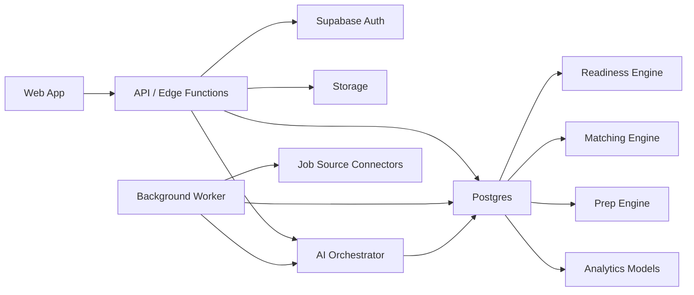
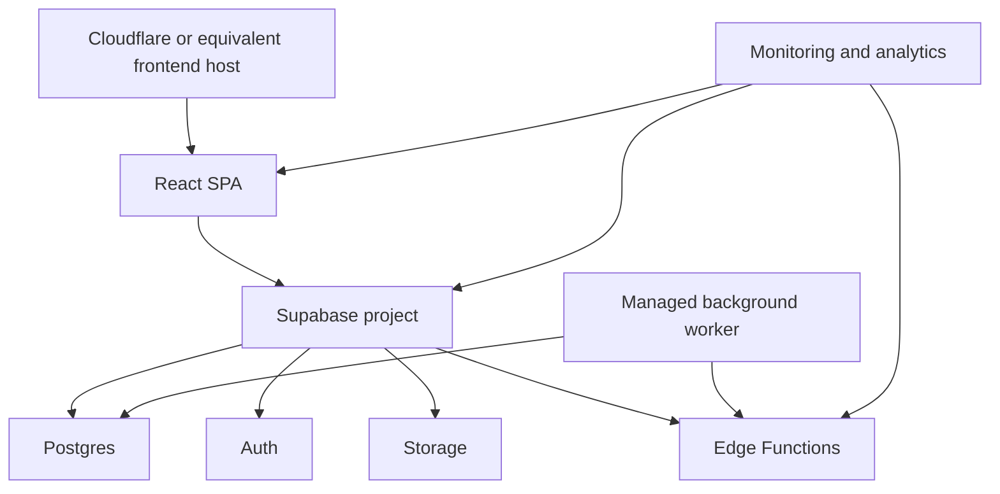
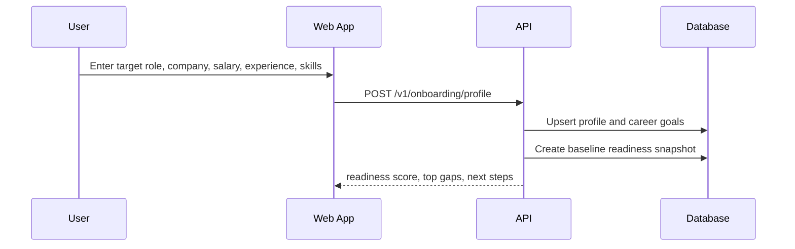
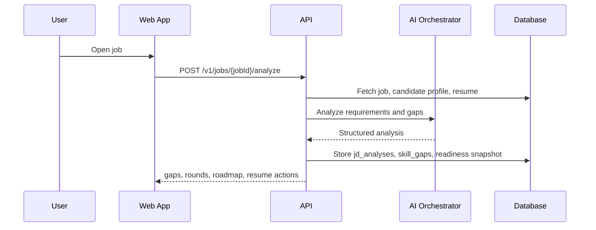
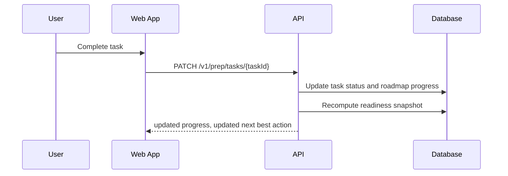

# System Architecture

## Architecture Decision

For March 19, 2026, the fastest production path is:

- Keep the current SPA pattern for the web client.
- Keep Supabase for auth, Postgres, storage, and row-level security.
- Move privileged AI orchestration, readiness scoring, scraping triggers, and normalization into server-side functions and background workers.
- Add a small internal API boundary so the frontend stops owning business-critical AI workflows.

This is an acceleration strategy, not a rewrite strategy.

## High-Level Stack

- Frontend: React SPA, Tailwind, component library, analytics SDK
- Auth: Supabase Auth
- Database: Supabase Postgres
- File storage: Supabase Storage
- Async compute: Edge functions plus one background worker service
- AI orchestration: server-side prompt templates, scoring services, provider abstraction
- Search: Postgres full-text search and indexed filters for launch
- Analytics: product analytics plus server logs
- Monitoring: error tracking, uptime checks, job-run alerts

## Logical Components

## Deployment Topology

## Core Services

### 1. Web App

Responsibilities:

- Authentication and session bootstrapping
- Onboarding flow
- Dashboard, jobs, prep, resume, CRM UI
- Optimistic task completion and saved job interactions
- Analytics event emission

Rules:

- The browser may read user-scoped data via authenticated APIs.
- The browser must not directly execute privileged AI or ingestion workflows.
- Direct table writes should be limited to low-risk user-owned records if needed; preferred path is BFF endpoints.

### 2. API and Edge Functions

Responsibilities:

- Onboarding submission and readiness initialization
- JD analysis orchestration
- Resume optimization orchestration
- Job matching calculation
- Dashboard aggregation
- Prep plan generation
- Admin-only scraper management endpoints

Rules:

- All AI prompts and API keys stay server-side.
- Every mutating AI endpoint stores structured output plus run metadata.
- Every response includes a trace ID for support and debugging.

### 3. Background Worker

Responsibilities:

- Scheduled job scraping
- Job normalization and deduplication
- Periodic match recomputation
- Resource enrichment
- Retry queues for failed AI tasks

Cadence:

- High-volume sources: every 4 to 6 hours
- Company career pages: every 12 hours
- Recompute job matches nightly and on major profile changes

### 4. Data Layer

Responsibilities:

- User profile and career goals
- Job inventory and structured requirements
- Readiness snapshots
- Prep roadmap and task completion
- CRM pipeline and outcomes

## AI Engine Design

### Skill Extraction Engine

Inputs:

- Resume text
- JD text
- User-entered skills

Outputs:

- normalized_skills
- tools
- domain tags
- seniority hints
- proof-of-work suggestions

Rules:

- Use deterministic normalization against a controlled skill taxonomy.
- Separate observed skills from inferred skills.

### Job Matching Engine

Inputs:

- career goals
- candidate profile
- job requirements
- location and salary preferences

Outputs:

- match_score
- readiness_score
- missing_skills
- next_actions

Launch logic:

- Start with rule-based and weighted scoring.
- Defer embeddings to post-launch unless search relevance is unacceptable.

### Skill Gap Detection Engine

Inputs:

- user skill inventory
- job skill requirements
- recent JD analyses

Outputs:

- strong_skills
- gap_skills
- importance labels

### Readiness Score Engine

Launch formula:

- 35% skill coverage
- 15% proof of work
- 15% resume fit
- 15% prep consistency
- 10% role clarity and targeting
- 10% application execution hygiene

Rules:

- If a component is unavailable, renormalize remaining weights.
- Always explain the top 3 factors affecting the score.
- Persist snapshots so improvement can be visualized over time.

### Career Recommendation Engine

Outputs:

- next best action
- jobs achievable in next 30, 60, and 90 days
- suggested mini-projects
- suggested content resources

### Interview Simulation Engine

Launch state:

- Feature-flagged as disabled
- Visible as `Soon you can experience this.`

## Key Data Flows

### Onboarding Flow

### Job Detail and JD Analysis

### Prep Task Completion

## Security Model

- RLS enabled on all user-owned tables.
- Service role only used inside server-side functions and worker environment.
- Secrets never exposed to client.
- Uploaded resumes stored in private buckets with signed URLs.
- AI prompts sanitized for prompt injection from job descriptions and uploaded files.
- Rate limiting on auth, JD analysis, resume optimization, and admin ingestion actions.
- Audit log for admin actions and background jobs.

## Performance Targets

- Dashboard p95 under 2.5 seconds after authentication
- Job search p95 under 1.5 seconds with cached filters
- JD analysis first token under 4 seconds, full response under 12 seconds
- Resume optimization under 15 seconds for 2-page resumes
- Mobile Lighthouse above 80 for performance and accessibility on launch pages

## Scaling Strategy

### Launch Scale

- Up to 10k jobs
- Up to 5k active users
- Up to 500 AI analyses per day

### Post-Launch Scale Levers

- Move heavy scraping and parsing fully to worker fleet
- Add cached dashboard aggregates
- Add materialized views for job discovery and readiness reporting
- Add vector search only when needed

## Architecture Risks

- Scraping reliability varies by source; require source health dashboards and fallbacks.
- AI latency can degrade UX; use async persistence and skeleton states.
- Readiness scoring can feel arbitrary; expose factor breakdown and recent changes.
- Frontend-coupled Supabase writes can drift business logic; centralize critical writes behind APIs.
